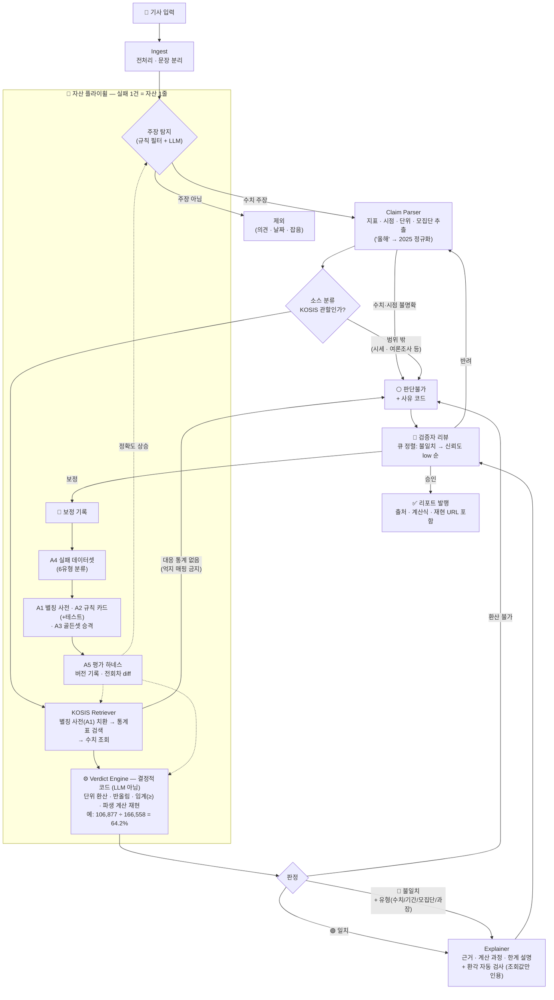

# ClaFact

**뉴스 속 수치 주장을 공식 통계로 검증한다. 판정은 AI가 아니라 코드가 한다.**

기사에서 "실업률이 10%에 달했다" 같은 수치 주장을 찾아 KOSIS 공식 통계와 대조하고,
**일치 / 불일치 / 판단불가**를 근거·계산 과정·재현 URL과 함께 내놓는 사실검증 엔진입니다.
클라비(CLABI) × 아이펠톤 기업 연계 프로젝트 — 팀 클라팩트 (인간 4명 + ClaFact Hermes Agent).

**🔴 라이브 데모** → https://clafact-buhqbmwbqcvjh8a29kxrhs.streamlit.app
샘플 버튼 한 번이면 검증·정직한 회피·플라이휠까지 전부 체험할 수 있습니다.

---

## 어떤 문제를 풀려는가

생성형 AI 이후 콘텐츠 생산 비용은 0에 수렴했지만, **검증 비용은 그대로**입니다.
그 간극에서 실제로 일어나는 문제들:

- **독자**는 기사 속 "실업률 10%", "1인 가구 150만"이 맞는지 확인할 방법이 사실상 없습니다. 원 통계를 찾아 대조하는 데 걸리는 시간은 건당 수십 분 — 아무도 하지 않습니다.
- **언론사**는 마감 시간 안에 모든 수치를 원자료와 대조하지 못합니다. 수치 오류는 출고 후에 발견되고, 정정보도는 신뢰 비용으로 돌아옵니다.
- **수작업 팩트체크 인프라는 지속되지 않았습니다.** 국내 유일 협업 팩트체크 플랫폼(SNU팩트체크)은 16개 언론사와 7년간 5,000여 건 — 하루 2건 수준 — 을 검증하고 재정 고갈로 멈췄습니다. 사람의 노동만으로는 처리량도 재정도 유지되지 않는다는 것이 실증된 상태입니다.
- **통계는 아는 사람에게만 정직합니다.** 잠정치가 확정치로 바뀌고, 지수의 기준연도가 개편되고, 모집단이 슬쩍 다른 채 인용됩니다 — 수치가 "틀리지 않았는데 틀린" 경우를 걸러줄 도구가 없습니다.

ClaFact는 이 중에서 **"공식 통계로 판정 가능한 수치 주장"**이라는, 기계가 정확하게 풀 수 있는 부분을 자동화합니다:

| 이런 문제가 | 이렇게 풀립니다 |
|---|---|
| 기사 수치가 맞는지 알 수 없음 | 주장을 KOSIS 원 통계와 자동 대조, 근거·계산 과정·재현 URL 제공 |
| 마감 내 전수 대조 불가능 | 기사 단위 배치 처리 — 사람은 시스템이 걸러낸 불일치만 확인 |
| 통계 함정(잠정치·기준연도·모집단) | 규칙 카드가 함정을 감지하면 판정을 거부하고 이유를 설명 |
| 검증 자체를 믿을 수 있는가 | 판정은 LLM이 아닌 결정적 코드 — 같은 입력, 같은 판정, 재현 가능 |

풀지 않는 문제도 분명히 합니다: 의견·가치판단, 공식 통계 밖의 수치(시세·여론조사),
이미지·영상 속 주장은 현재 범위 밖이고 — 범위 밖은 범위 밖이라고 표시합니다.

## 우리가 지키는 세 가지 원칙

**1. 환각은 판정에 개입할 수 없다.**
LLM의 역할은 탐지·추출·설명까지입니다. 판정은 단위 정규화·반올림·임계 비교를 수행하는
**결정적 코드**([`pipeline/verdict.py`](clafact/pipeline/verdict.py))가 내립니다.
같은 입력은 언제나 같은 판정 — 그래서 모든 판정에 **재현 URL**이 붙습니다
([`audit.py`](clafact/audit.py), 인증키는 마스킹).

**2. 모르는 것은 모른다고 말한다.**
"판단불가"는 실패가 아니라 제품입니다. 통계가 잠정치라 기사 시점의 값을 알 수 없으면(규칙 A2-0012),
지수의 기준연도를 특정할 수 없으면(A2-0013), 주장이 KOSIS 밖 소스(코스피·환율)를 가리키면 —
검증하는 척하지 않고 **이유를 밝히며 판정을 거부**합니다.
7년간 5,000건을 검증한 SNU팩트체크의 "판단유보"가 저널리즘에서 증명한 그 원칙을, 코드로 계승했습니다.

**3. 실패 1건 = 자산 1줄.**
매핑이 실패하면 별칭 사전에, 판정이 틀리면 규칙 카드에, 리뷰에서 뒤집히면 골든셋에 — 예외 없이 적립됩니다.
규칙 카드는 문서가 아니라 **런타임에 로드되는 실행 자산**이고, 테스트 없는 규칙은 등록이 거부됩니다.
실측 사례: 골든셋 1건 추가 → F1 1.0000 → **0.9474로 하락**(골든셋이 진짜라는 증거) → 규칙 생성 → **1.0000 회복**.

## 어떻게 동작하는가

전 과정이 상태 머신([`schemas.py`](clafact/schemas.py))으로 관리되고, 서비스층
([`service/`](clafact/service))이 멱등 적재·건별 격리·리뷰 큐·발행등급(불일치는 무조건 사람 승인)을 책임집니다.
설계 노트는 [docs/architecture.md](docs/architecture.md).

## 숫자로 보는 현재 상태

| 항목 | 값 |
|---|---|
| 테스트 | **156건 통과** (`pytest`, 오프라인 기본). 4계층 구조 — 기본(무과금·결정적)·`@dataset`(실물 회귀)·`@contract`(HCX 재생)·`@eval`(정확도 게이트) |
| 규칙 카드 (A2) | 12종 — 임계 판정, 반올림, 상대 시점, 잠정치 회피, 기준연도 회피 등 |
| 판정 유형 | 단순 대조 · 파생 계산(합산·비율) · 단위 환산 · 임계 표현 · 함정 회피 |
| 매핑 실험 (EXP-001) | 하이브리드 검색 Hit@3 1.00 — *단, 파일럿 규모(평가 10건·표 5개)라 포화. 실전 검증은 28만 표 대상 경로 C에서* |
| KOSIS 조사 | OpenAPI **7종 전수 조사** 기술백서 — 통합검색 경로 발굴, 호출 예산·라이선스·함정 8종 규명 |
| 코어 의존성 | **표준 라이브러리만** (Python 3.10+) — 데모 UI만 Streamlit |

정직한 한계도 함께: 현재 커버리지는 **KOSIS 통계에 대응되는 수치 주장**입니다.
의견·가치판단, 비-KOSIS 소스(금융 시세 등), 이미지·영상은 범위 밖이고 — 범위 밖은 범위 밖이라고 표시합니다.

## 직접 확인해 보기

이 README의 주장은 전부 직접 검증할 수 있습니다.

- **설치 없이 (브라우저만)** — [라이브 데모](https://clafact-buhqbmwbqcvjh8a29kxrhs.streamlit.app)에서
  "잠정치 함정"·"기준연도 함정" 샘플을 눌러보세요. 시스템이 검증하는 척하지 않고
  **이유를 설명하며 판정을 거부하는 것**이 이 프로젝트의 핵심 장면입니다.
- **코드로 (개발자)** — 클론 후 테스트 한 줄(`pytest`, 134건·약 12초)이 외부 API·키 없이
  전부 통과합니다. 판정 로직이 네트워크·LLM 상태와 무관하게 결정적이라는 증거입니다.
  평가 하네스·운영 CLI까지 포함한 전체 검증 절차는 **[docs/verify.md](docs/verify.md)**.

## 저장소 지도 — 원칙이 코드 어디에 사는가

폴더 목록이 아니라, **README의 주장을 코드에서 확인하는 안내표**입니다:

| 이 주장을 확인하려면 | 여기를 보세요 |
|---|---|
| "판정은 LLM이 아닌 결정적 코드" | [`clafact/pipeline/verdict.py`](clafact/pipeline/verdict.py) — import 목록에 LLM이 없다. 단위 환산·반올림·임계 비교뿐 |
| "모든 판정에 재현 URL" | [`clafact/audit.py`](clafact/audit.py) — 재현 URL과 실 호출이 **같은 함수**로 만들어진다 (어긋날 수 없는 구조) |
| "판단불가는 실패가 아니라 제품" | [`data/assets/rules/`](data/assets/rules) — 잠정치(A2-0012)·기준연도(A2-0013) 등 판정 거부 규칙 카드. 각 카드에 유래 실패와 테스트가 링크됨 |
| "규칙 카드는 실행 자산" | [`clafact/assets/rules.py`](clafact/assets/rules.py) — 카드의 패턴이 런타임에 로드된다. 테스트 없는 규칙은 등록 거부 |
| "실패 1건 = 자산 1줄" | [`clafact/assets/failures.py`](clafact/assets/failures.py) — 실패를 resolve하려면 파생 자산 ID가 필수인 감사 장치 |
| "모든 변경은 diff로 증명" | [`clafact/eval/harness.py`](clafact/eval/harness.py) — 실행마다 코드 버전 기록, 전 회차 자동 비교 |
| "불일치는 무조건 사람 승인" | [`clafact/service/batch.py`](clafact/service/batch.py) — 발행등급 분류(triage)가 정책을 코드로 강제 |
| 파이프라인 전체 흐름 | [`clafact/pipeline/`](clafact/pipeline) — ingest → detect → parse → retrieve → verdict → run 순서로 파일이 곧 단계 |
| 팀이 실제로 일하는 방식 | [`ops/`](ops) — 프로젝트 상태·결정 기록 (Hermes Agent 작업 공간), [`.claude/agents/`](.claude/agents) — 역할별 보조 에이전트 정의 |

커밋에서 볼 수 없는 것도 명시합니다: 검증 대상 데이터셋·서비스 DB·외부 수집 자료는
`.gitignore`로 커밋이 차단되어 있습니다 (저작권·개인정보 보호).

## 지금, 그리고 다음

**실구현 스프린트 진행 중 — 2026-07-20 시작, 09-09(수) 최종 발표. 실작업 약 42일.**

| 구간 | 기간 | 목표 | 게이트 |
|---|---|---|---|
| 스퍼트 1 | 07-20 ~ 07-31 | 킥오프·역할 확정, **경로 C(KOSIS 통합검색, 28만 표) 실측**, 경제면 Claim 50건 소스 분류, 골든셋 파일럿 50건, HCX 연동 착수 | G1(매핑 경로 근거) · G-SOURCE-1(50건 분류) · 휴가 전 작업 동결 |
| 휴가 | 08-01 ~ 08-09 | 팀 휴가 — 일정 없음 | — |
| 스퍼트 2 | 08-10 ~ 09-06 | 검색·매핑 고도화(EXP-001 경로 비교, 임베딩·리랭커) → 조선일보 데이터셋 대량 처리·골든셋 250건 → FastAPI 서빙·설명 생성 E2E → 최종 평가 | 매핑 개선 실측 · 골든셋 250건 · 릴리스 게이트 · 09-06 데모 프리즈 |
| 발표 | 09-07 ~ 09-09 | 리허설 2회 후 **09-09(수) 최종 발표** | 최종 발표 |

이 엔진의 본질은 "자연어 수치 주장 ↔ 공식 데이터" 정렬입니다. 뉴스 검증은 첫 번째 수직 시장이고,
같은 엔진이 보도자료 검수, 공시·정책 자료 검증, 그리고 **AI 생성 출력의 수치 환각 검증 레이어**로 확장됩니다.

## 라이선스와 출처

- 코드는 **MIT 라이선스**로 공개합니다 — [LICENSE](LICENSE).
- 검증 근거 데이터는 **KOSIS 국가통계포털**(통계청, 현 국가데이터처)의 공공데이터를 이용하며,
  모든 판정 결과에 출처(기관·통계표·조회 시점)를 표시합니다. 국내통계는 KOSIS 이용 정책에 따라
  출처표시 조건 하에 활용하며, 재배포가 제한되는 국제·북한통계는 사용하지 않습니다.

---

*"AI가 다 안다"가 아니라, 아는 것과 모르는 것을 구분하는 AI. 그게 우리가 만드는 신뢰입니다.*
