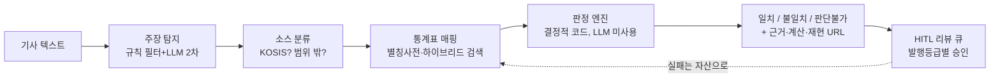

# ClaFact

**뉴스 속 수치 주장을 공식 통계로 검증한다. 판정은 AI가 아니라 코드가 한다.**

기사에서 "실업률이 10%에 달했다" 같은 수치 주장을 찾아 KOSIS 공식 통계와 대조하고,
**일치 / 불일치 / 판단불가**를 근거·계산 과정·재현 URL과 함께 내놓는 사실검증 엔진입니다.
클라비(CLABI) × 아이펠톤 기업 연계 프로젝트 — 팀 클라팩트 (인간 4명 + ClaFact Hermes Agent).

**🔴 라이브 데모** → https://clafact-buhqbmwbqcvjh8a29kxrhs.streamlit.app
샘플 버튼 한 번이면 검증·정직한 회피·플라이휠까지 전부 체험할 수 있습니다.

---

## 우리가 지키는 세 가지 원칙

**1. 환각은 판정에 개입할 수 없다.**
LLM의 역할은 탐지·추출·설명까지입니다. 판정은 단위 정규화·반올림·임계 비교를 수행하는
**결정적 코드**([`pipeline/verdict.py`](clafact/pipeline/verdict.py))가 내립니다.
같은 입력은 언제나 같은 판정 — 그래서 모든 판정에 **재현 URL**이 붙습니다
([`audit.py`](clafact/audit.py), 인증키는 마스킹).

**2. 모르는 것은 모른다고 말한다.**
"판단불가"는 실패가 아니라 제품입니다. 통계가 잠정치라 기사 시점의 값을 알 수 없으면(규칙 A2-0012),
지수의 기준연도를 특정할 수 없으면(A2-0013), 주장이 KOSIS 밖 소스(코스피·환율)를 가리키면 —
검증하는 척하지 않고 **이유를 밝히며 판정을 거부**합니다.
7년간 5,000건을 검증한 SNU팩트체크의 "판단유보"가 저널리즘에서 증명한 그 원칙을, 코드로 계승했습니다.

**3. 실패 1건 = 자산 1줄.**
매핑이 실패하면 별칭 사전에, 판정이 틀리면 규칙 카드에, 리뷰에서 뒤집히면 골든셋에 — 예외 없이 적립됩니다.
규칙 카드는 문서가 아니라 **런타임에 로드되는 실행 자산**이고, 테스트 없는 규칙은 등록이 거부됩니다.
실측 사례: 골든셋 1건 추가 → F1 1.0000 → **0.9474로 하락**(골든셋이 진짜라는 증거) → 규칙 생성 → **1.0000 회복**.

## 어떻게 동작하는가



전 과정이 상태 머신([`schemas.py`](clafact/schemas.py))으로 관리되고, 서비스층
([`service/`](clafact/service))이 멱등 적재·건별 격리·리뷰 큐·발행등급(불일치는 무조건 사람 승인)을 책임집니다.

## 숫자로 보는 현재 상태

| 항목 | 값 |
|---|---|
| 테스트 | **134건 통과** (`pytest`, 외부 의존성 없이 오프라인 전량 실행) |
| 규칙 카드 (A2) | 12종 — 임계 판정, 반올림, 상대 시점, 잠정치 회피, 기준연도 회피 등 |
| 판정 유형 | 단순 대조 · 파생 계산(합산·비율) · 단위 환산 · 임계 표현 · 함정 회피 |
| 매핑 실험 (EXP-001) | 하이브리드 검색 Hit@3 1.00 — *단, 파일럿 규모(평가 10건·표 5개)라 포화. 실전 검증은 28만 표 대상 경로 C에서* |
| KOSIS 조사 | OpenAPI **7종 전수 조사** 기술백서 — 통합검색 경로 발굴, 호출 예산·라이선스·함정 8종 규명 |
| 코어 의존성 | **표준 라이브러리만** (Python 3.10+) — 데모 UI만 Streamlit |

정직한 한계도 함께: 현재 커버리지는 **KOSIS 통계에 대응되는 수치 주장**입니다.
의견·가치판단, 비-KOSIS 소스(금융 시세 등), 이미지·영상은 범위 밖이고 — 범위 밖은 범위 밖이라고 표시합니다.

## 빠른 시작

```bash
# 전체 테스트 (오프라인, 12초)
PYTHONPATH=. python -m pytest tests/ -q

# 평가 하네스 — 골든셋 전 지표 + 전 회차 대비 diff
python scripts/run_eval.py

# 데모 (로컬)
streamlit run streamlit_app.py

# 서비스 파이프라인 — 기사 적재 → 처리 → 리뷰 큐 → 리포트
python scripts/service_run.py ingest 기사.jsonl
python scripts/service_run.py process
python scripts/service_run.py queue
```

실 KOSIS API는 `.env`의 키로 스위치됩니다(키 없이도 픽스처로 전 기능 동작).
**API 키는 커밋·공유 금지** — 재현 URL에도 키는 마스킹되어 출력됩니다.

## 저장소 지도

```
clafact/            엔진 — pipeline(탐지·파싱·매핑·판정), assets(별칭·규칙·골든셋), service(적재·큐), audit
tests/              134건 — 규칙마다 테스트, 키 유출 방지 회귀 테스트 포함
scripts/            run_eval(평가), release_gate(공개 전 게이트), service_run(운영 CLI), review_cli(HITL)
data/               골든셋·규칙 카드·실패 레코드 (검증 데이터셋·외부 수집물은 .gitignore로 커밋 차단)
ops/                프로젝트 운영 체계 — PROJECT_STATE, 문서 인덱스 (Hermes Agent 작업 공간)
docs/architecture.md  설계 다이어그램(머메이드)
```

## 지금, 그리고 다음

**실구현 스프린트 40일 (2026-07-20 ~ 08-28) 진행 중.**
W1 게이트: 경로 C(KOSIS 통합검색, 28만 표) 실측 · 경제면 Claim 50건 소스 분류 · 골든셋 파일럿 50건.

이 엔진의 본질은 "자연어 수치 주장 ↔ 공식 데이터" 정렬입니다. 뉴스 검증은 첫 번째 수직 시장이고,
같은 엔진이 보도자료 검수, 공시·정책 자료 검증, 그리고 **AI 생성 출력의 수치 환각 검증 레이어**로 확장됩니다.
확장 카탈로그와 3단계 로드맵은 프로젝트 문서(01 제안서, 08 사업전략, 09 확장과제)에 있습니다.

---

*"AI가 다 안다"가 아니라, 아는 것과 모르는 것을 구분하는 AI. 그게 우리가 만드는 신뢰입니다.*
