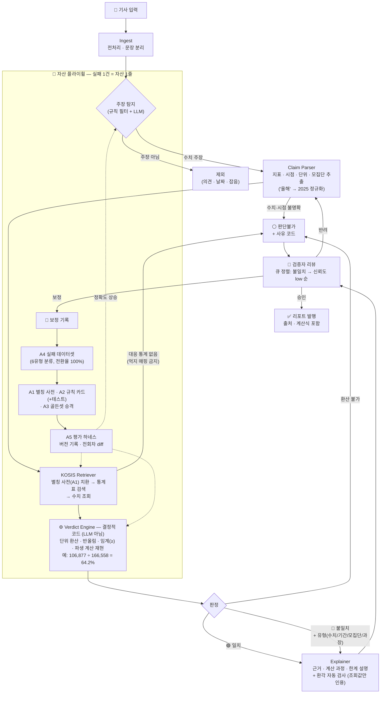

# ClaFact 설계 구조

기사 속 수치 주장을 국가통계(KOSIS)로 자동 검증하는 파이프라인.
핵심 원칙: **판정은 LLM이 아닌 결정적 코드** · **근거 없으면 판단불가로 정직하게 회피** · **실패 1건 = 자산 1줄**

```mermaid
flowchart TD
    A["📰 기사 입력"] --> B["Ingest<br/>전처리 · 문장 분리"]
    B --> C{"주장 탐지<br/>(규칙 필터 + LLM)"}
    C -->|"주장 아님"| X0["제외<br/>(의견 · 날짜 · 잡음)"]
    C -->|"수치 주장"| D["Claim Parser<br/>지표 · 시점 · 단위 · 모집단 추출<br/>('올해' → 2025 정규화)"]
    D -->|"수치·시점 불명확"| U["⚪ 판단불가<br/>+ 사유 코드"]
    D --> E["KOSIS Retriever<br/>별칭 사전(A1) 치환 → 통계표 검색<br/>→ 수치 조회"]
    E -->|"대응 통계 없음<br/>(억지 매핑 금지)"| U
    E --> F["⚙️ Verdict Engine — 결정적 코드 (LLM 아님)<br/>단위 환산 · 반올림 · 임계(≥) · 파생 계산 재현<br/>예: 106,877 ÷ 166,558 = 64.2%"]
    F --> G{"판정"}
    G -->|"🟢 일치"| H
    G -->|"🔴 불일치<br/>+ 유형(수치/기간/모집단/과장)"| H
    G -->|"환산 불가"| U
    H["Explainer<br/>근거 · 계산 과정 · 한계 설명<br/>+ 환각 자동 검사 (조회값만 인용)"] --> I["👤 검증자 리뷰<br/>큐 정렬: 불일치 → 신뢰도 low 순"]
    U --> I
    I -->|"승인"| J["✅ 리포트 발행<br/>출처 · 계산식 포함"]
    I -->|"보정"| K["📝 보정 기록"]
    I -->|"반려"| D

    subgraph FLY["🔄 자산 플라이휠 — 실패 1건 = 자산 1줄"]
        K --> L["A4 실패 데이터셋<br/>(6유형 분류, 전환율 100%)"]
        L --> M["A1 별칭 사전 · A2 규칙 카드(+테스트)<br/>· A3 골든셋 승격"]
        M --> N["A5 평가 하네스<br/>버전 기록 · 전회차 diff"]
        N -.->|"정확도 상승"| C
        N -.-> E
        N -.-> F
    end
```

상세: [워크플로우 정의서(문서 10)] · 상태 머신은 `clafact/schemas.py` 가 단일 진실.
