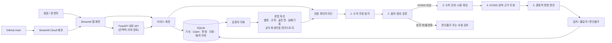

# ClaFact 시스템 구조

```mermaid
flowchart LR
    U["팀원 / 운영자"] --> UI["Streamlit 웹 화면"]
    UI --> API["FastAPI 내부 API<br/>(선택적 서버 경로)"]
    UI --> SVC["서비스 계층"]
    API --> SVC

    SVC --> DB[("SQLite<br/>기사 · Claim · 판정 · 리뷰 · 배치 이력")]
    SVC --> PIPE["검증 파이프라인"]

    PIPE --> DET["1. 수치 주장 탐지"]
    DET --> CLS["2. 출처·범위 분류"]
    CLS -->|KOSIS 대상| PARSE["3. 수치·단위·시점 파싱"]
    CLS -->|범위 밖/불명확| UNV["판단불가 또는 사람 검토"]
    PARSE --> RET["4. KOSIS 검색·근거 조회"]
    RET --> VER["5. 결정적 판정 엔진"]
    VER --> RES["일치 / 불일치 / 판단불가"]

    REG["운영 자산<br/>별칭 · 규칙 · 골든셋 · 실패기록<br/>공식 파생지표 레지스트리"] --> PIPE
    RES --> DB
    DB --> REVIEW["검증자 리뷰"]
    REVIEW --> REG

    GIT["GitHub main"] --> DEPLOY["Streamlit Cloud 배포"]
    DEPLOY --> UI
```
