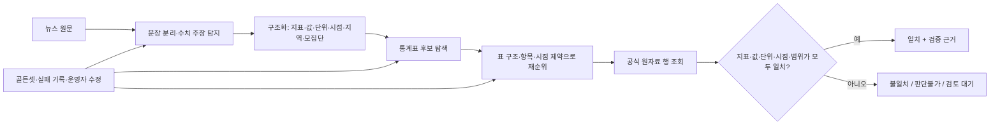
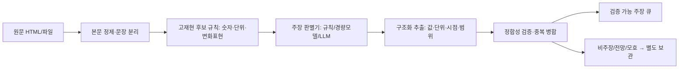
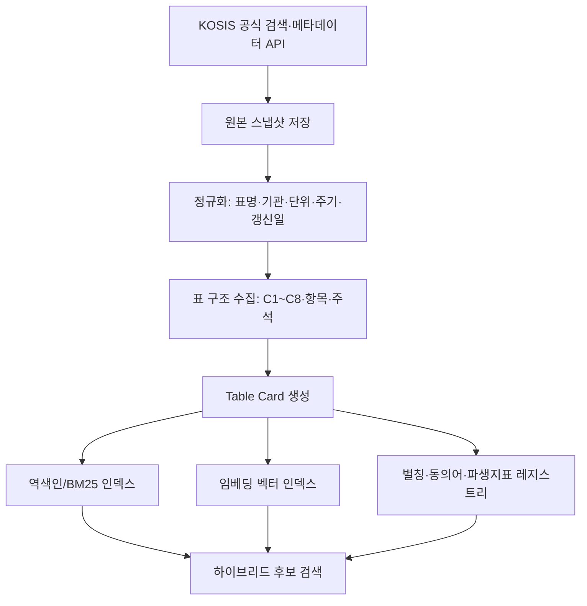
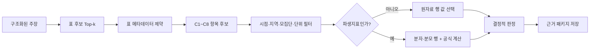

# ClaFact 수치 주장 전처리 · KOSIS 통계표 매핑 연구/실험 마스터플랜

> 목적: 업체 미팅에서 요구한 두 핵심 과제(① 뉴스 수치 주장 전처리, ② KOSIS 통계표 탐색·매핑)를 **재현 가능한 데이터·실험·판정 체계**로 준비한다. 이 문서는 기능 아이디어 목록이 아니라, 무엇을 어떤 데이터로 비교하고 어떤 기준을 통과하면 제품에 채택할지를 정한 실행 문서다.

## 0. 한 장 요약

ClaFact의 최종 목표는 뉴스 문장의 숫자를 단순히 비슷한 KOSIS 숫자와 찾는 것이 아니다. 아래의 여섯 조건이 모두 맞을 때에만 “일치”로 판정하는 **근거 기반 매핑**을 만드는 것이다.



이 계획의 핵심 원칙은 다음과 같다.

1. **LLM은 이해와 후보 생성에 쓰고, 최종 숫자 판정은 결정적 규칙으로 한다.** 모델이 그럴듯한 통계표나 숫자를 만들어 내는 위험을 없앤다.
2. **“정답 표를 찾았는가”와 “정답 행을 찾았는가”를 분리해 측정한다.** 표 검색 성능만 높아도 C1~C8 항목, 지역, 시점이 틀리면 오판이 된다.
3. **KOSIS의 전체 통계표 수는 고정 상수가 아니다.** 업체가 언급한 288,663건 이상은 초기 규모 가정으로 기록하고, 실제 수집 날짜·검색 범위·국내/국제/중지통계 포함 여부가 남은 스냅샷으로 확정한다.
4. **자동화율보다 위험한 자동 일치를 먼저 줄인다.** 확신이 낮으면 판단불가/검토 대기로 보내고, 근거 URL·표 ID·행 조건이 없는 “일치”는 허용하지 않는다.

### 업체에 제시할 최종 산출물

| 영역 | 보여 줄 산출물 | 업체가 확인할 수 있는 질문 |
|---|---|---|
| 수치 주장 | 라벨링 가이드, 익명화된 골든셋, 유형별 혼동행렬, 추출 비교표 | 어떤 문장을 주장으로 보며 어떤 경우에 보류하는가? |
| KOSIS 카탈로그 | 통계표 메타데이터 스냅샷, 분류체계, 표 카드(Table Card) | 28만+ 표를 어떤 축으로 줄이고 설명 가능한가? |
| 검색 | 키워드/BM25/임베딩/하이브리드 A/B 결과 | 유사어·표현 차이에도 정답 표가 Top-k에 들어오는가? |
| 매핑 | 표→항목→시점→값 정합성 로그, 실패 사례집 | “숫자가 같다”가 아닌 “같은 의미”임을 어떻게 보장하는가? |
| 운영 | 재현 명령, 데이터 버전, 오류 대시보드, 사람 검토 큐 | 새로운 분야가 들어와도 같은 절차로 확장 가능한가? |

---

## 1. 현재 기준선: 이미 있는 것과 아직 검증해야 할 것

### 1.1 현재 구현에서 확인된 기준선

현재 저장소에는 다음의 출발점이 있다. 이는 **연구의 베이스라인**이지, 전체 도메인에서 정확도가 입증됐다는 의미는 아니다.

| 단계 | 현재 기준선 | 코드/자산 |
|---|---|---|
| 주장 유형 | `규모형 → 증감형 → 파생계산형 → 전망형 → 임계형 → 순위형` 6종을 규칙 우선순위로 단일 분류 | `clafact/pipeline/source_classify.py` |
| 라우팅 | KOSIS 대상, 복합/고난도 KOSIS, 비KOSIS 공식 출처, 전망·해외·불명확을 각각 다른 큐로 보냄 | `source_classify.py`, `service/store.py` |
| 값 파싱 | 숫자·단위·배수·증감 방향·시점의 일부를 규칙으로 정규화 | `clafact/pipeline/parse.py` |
| 후보 탐색 A | 별칭·핵심어를 이용한 키워드 탐색 | `clafact/pipeline/retrieve.py` |
| 후보 탐색 B | 외부 의존성 없는 문자 n-gram TF-IDF 의미 유사도 프로토타입 | `clafact/pipeline/retrieve_semantic.py` |
| 후보 탐색 C | KOSIS 통합검색 API 후보를 받아 재순위화 | `clafact/kosis.py`, `pipeline/retrieve_kosis.py` |
| 재순위 | 청년/출생아 등 핵심어, 국내/국제, 지역/전국, 월/연 주기, 시점 등을 설명 가능한 규칙으로 가점 | `clafact/pipeline/rerank.py` |
| 파생지표 | 다문화 혼인 비중처럼 분자·분모가 명확한 일부 공식 파생지표 레지스트리 | `data/assets/official_share_metrics.json` |
| 평가 자산 | 골든셋 및 semantic/rerank/분류 단위 테스트의 출발점 | `data/goldenset/`, `tests/` |

KOSIS는 주제별·기관별 통계목록과 통합검색을 제공하고, OpenAPI 메타데이터에는 통계표 명칭·기관·수록정보·분류/항목·주석·단위·출처·갱신일 등이 포함된다. 이 메타데이터는 우리 카탈로그의 기본 재료가 된다. [KOSIS 통계목록](https://kosis.kr/statisticsList/statisticsListIndex.do?menuId=M_01_01&outLink=Y), [KOSIS OpenAPI 개발가이드](https://kosis.kr/openapi/file/openApi_manual_v1.0.pdf)

### 1.2 정직하게 구분할 현재 한계

- 6종 단일 라벨은 복합 문장(예: “전년보다 3% 감소해 역대 최저”)을 충분히 표현하지 못한다.
- 문자 n-gram은 한국어 조사·오탈자에는 강한 편이지만, 의미적으로 멀어진 동의어·전문 약어에는 한계가 있다.
- KOSIS 통합검색 결과가 있어도 정답은 “표”가 아니라 **표의 특정 항목·시점·지역 행**이므로 검색 성능만으로 판정 정확도를 말할 수 없다.
- API 연결 실패, 공개 범위 차이, 시계열 단절, 통계표 개편은 모델 문제가 아니라 운영·데이터 문제다.
- 현재 소규모 파일럿 결과가 있다면 반드시 `표본 수·분야·수집일·정답 정의`를 함께 표시한다. 이를 전체 성능으로 확대 해석하지 않는다.

---

## 2. 공통 연구 설계: 측정 없이는 개선도 없다

### 2.1 정답 데이터(골든셋) 설계

한 문장에 숫자가 있다고 모두 수치 주장은 아니다. 다음 세 레벨을 분리해 라벨링한다.

| 레벨 | 단위 | 핵심 라벨 |
|---|---|---|
| 문장 | 기사 내 문장 | 주장 여부, 숫자 스팬, 문장 역할(본문/인용/제목/날짜/연락처) |
| 주장 | 검증 가능한 최소 단위 | 유형, 지표, 주장값, 단위, 시점, 비교 기준, 지역, 모집단, 출처 힌트 |
| 근거 | KOSIS 표와 행 | `TBL_ID`, 기관, 표명, C1~C8 항목, `PRD_DE`, 단위, 공식값, 계산식, URL |

권장 스키마는 다음과 같다.

```json
{
  "claim_id": "news_20260726_001_c02",
  "article_date": "2025-11-06",
  "sentence": "2024년 다문화 혼인 비중은 9.6%로 전년보다 1.0%p 감소했다.",
  "numeric_spans": ["2024년", "9.6%", "1.0%p"],
  "is_verifiable_claim": true,
  "claim_types": ["비율", "증감"],
  "metric": "다문화 혼인 비중",
  "value": 9.6,
  "unit": "%",
  "period": "2024",
  "comparison_period": "2023",
  "geography": "전국",
  "population": "전체 혼인",
  "expected": {
    "source": "KOSIS_OR_OFFICIAL_RELEASE",
    "tbl_id": "<정답 표 ID>",
    "coordinates": {"C1": "…", "C2": "…", "PRD_DE": "2024"},
    "official_value": 9.6,
    "formula": "다문화 혼인 건수 / 전체 혼인 건수 * 100"
  }
}
```

### 2.2 표본 구성과 분할

초기에는 무작정 큰 데이터보다 **오류가 잘 드러나는 층화 표본**이 중요하다.

| 단계 | 목표 표본 | 구성 | 사용 목적 |
|---|---:|---|---|
| Seed | 100 주장 | 유형 6종 × 대표 분야, 쉬운/어려운 사례 혼합 | 라벨 규칙과 파이프라인 연결 확인 |
| Core | 300 주장 | 인구·고용·물가·주거·보건·교육 등, 지역·월/분기/연 포함 | 방법별 A/B와 오류 분석 |
| Holdout | 100 주장 | 개발 중 보지 않은 기사·시점·기관 | 과적합 없는 최종 비교 |
| Stress | 300+ 주장 | 복합 문장, 파생지표, 표 개편, 표기 변형, API 실패 재현 | 운영 안정성 검증 |

- **시간 분리:** 개발 데이터보다 뒤에 발행된 기사로 holdout을 만든다. 같은 보도자료를 재서술한 문장이 양쪽에 섞이지 않게 한다.
- **출처 분리:** 같은 언론사·같은 보도자료의 반복 문구가 train/test 양쪽에 들어가지 않게 기사 군집 단위로 분할한다.
- **표 분리:** 가능하면 특정 `TBL_ID`를 holdout에 통째로 남겨, 외운 표가 아니라 새 표에도 검색되는지 측정한다.
- **이중 라벨링:** 20% 이상을 두 명이 독립 라벨링하고 Cohen’s κ(범주형), 스팬 일치율, 값·단위·시점 정확 일치율을 기록한다. 불일치는 운영자 회의에서 판정 이유까지 남긴다.

### 2.3 공통 성공 지표와 안전 게이트

| 구간 | 주 지표 | “통과”의 의미 |
|---|---|---|
| 주장 탐지 | Precision / Recall / F1, 숫자 스팬 F1 | 실제 주장 누락과 날짜·전화번호 오탐을 함께 관리 |
| 구조화 | 지표·값·단위·시점·지역 field exact match | 값만 맞아도 단위/시점이 틀리면 실패 |
| 표 검색 | Recall@1/3/10, MRR, nDCG@10 | 정답 표가 후보 Top-k 안에 들어오는가 |
| 행 매핑 | 좌표 정확도, 값·단위·시점·모집단 all-match | 같은 표의 틀린 행을 막는가 |
| 최종 판정 | 일치/불일치/판단불가 macro-F1, 위험 오일치율 | 자동 ‘일치’가 틀리는 비율을 별도 최우선 관리 |
| 운영 | p50/p95 지연, 주장당 API 호출 수, 재시도 성공률, 검토 전환율 | 실제 배치·웹 화면에서도 지속 가능한가 |

**배포 게이트**는 다음처럼 보수적으로 둔다.

1. 표 검색 Recall@10이 부족하면 재순위 모델을 바꾸기 전에 카탈로그·별칭·쿼리 생성부터 보완한다.
2. 표는 맞는데 행 매핑이 틀리면 자동 판정을 금지하고 검토 대기로 내린다.
3. 근거 행 URL, 조회 조건, 원문 응답 해시 중 하나라도 없으면 “검증 완료”가 아니라 “근거 미완성”으로 표시한다.
4. 새로운 분야는 기존 전체 평균이 아니라 **해당 분야 holdout**을 통과해야 자동화 범위에 넣는다.

---

## 3. 연구 축 A — 뉴스 수치 주장 탐지·전처리

### 3.1 분류 체계: 현재 6종을 다층 체계로 확장

현재의 단일 6종 라벨은 운영 라우팅에 계속 쓰되, 학습·평가 데이터는 아래처럼 **여러 축을 동시에 기록**한다. 한 문장을 하나의 상자에 억지로 넣지 않기 위해서다.

| 축 | 값 | 예시 |
|---|---|---|
| 주장성 | 사실 주장 / 비주장 숫자 / 모호 | “실업률은 2.7%” / “6일 발표” / “약 2% 내외” |
| 측정 의미 | 규모 / 비율·구성비 / 증감률 / 증감량 / 순위 / 임계 / 평균·중앙 / 지수 / 파생계산 / 전망 | “150만 명”, “9.6%”, “1.0%p 감소”, “1위” |
| 시간 | 특정시점 / 기간 / 전년동월비 / 전기비 / 누계 / 미래 | “2024년”, “1~6월”, “전월 대비” |
| 비교 | 없음 / 절대차 / 상대변화 / 기준 초과·미만 / 순위 비교 | “3만 명 증가”, “10% 넘었다” |
| 범위 | 전국/지역, 전체/하위집단, 산업/연령/성별 | “서울 1인 가구”, “15~29세 청년” |
| 검증 경로 | KOSIS 직접 / KOSIS 파생 / 공식 보도자료 / 비KOSIS / 사람 검토 | 다문화 혼인 비중은 KOSIS 파생 가능 |
| 위험 플래그 | 반올림, 잠정치, 전망, 인용 출처 미상, 복수 숫자, 단위 모호 | “약 2%”, “올해 말 예상” |

#### 현재 6종의 판정 규칙과 보완점

| 현재 유형 | 현재의 대표 신호 | 보완해야 할 점 |
|---|---|---|
| 규모형 | 명·가구·건·원·% 등 절대 수치 | 비율과 단순 수치를 구분하는 세부 라벨 추가 |
| 증감형 | 증가/감소, 전년 대비, 상승/하락 | %와 %p, 증감량과 증감률, 비교 기준을 별도 필드화 |
| 파생계산형 | “10명 중 6명”, 비중/비율 | 분자·분모·계산식을 추출해 레지스트리와 연결 |
| 전망형 | 전망/예상/내다봤다 | 사실 주장과 예측을 분리하고 기본 자동판정 제외 |
| 임계형 | 넘었다/미만/이상/이하 | 부등호와 기준값을 구조화해 경계값을 정확히 판정 |
| 순위형 | 최대/최저/1위/역대 | 비교 집합, 기간, 동률 여부가 있어야 검증 가능 |

### 3.2 “뉴스 속 숫자 문장”을 분리하는 4단계 파이프라인



1. **본문 정제와 문장 분리:** 제목·부제·본문·표 캡션·기자 연락처·날짜를 필드로 구분한다. 한국어 종결어미, 인용부호, 괄호, `1.2%p`, `2024. 6.`와 소수점을 고려한 문장 분리기를 비교한다.
2. **고재현 후보 생성:** 정규식과 형태소 분석을 이용해 숫자, 한국어 수사(한 명/두 배), 단위, 비교·변화 동사를 잡는다. 이 단계는 일부 오탐을 허용하되 누락을 최소화한다.
3. **주장 판별:** 후보 문장이 “공식 통계와 대조 가능한 사실 주장”인지 판별한다. 발표일·전화번호·기사 순번·법 조항 번호는 제거한다.
4. **구조화와 검증:** 문장 전체를 LLM에 맡기지 않고, 규칙 파서와 추출 결과를 대조한다. 예를 들어 `%p`는 `%`로 자동 변환하지 않고, ‘올해’는 기사 발행일 기준으로만 해석하며 신뢰도를 남긴다.

### 3.3 비교할 방법군

| ID | 방법 | 장점 | 예상 실패 양상 | 역할 |
|---|---|---|---|---|
| A0 | 정규식만 | 빠르고 설명 가능, 비용 0 | 은유·생략·복합 문장 누락 | 하한선(baseline) |
| A1 | 규칙 + 형태소 분석 | 단위/수식 범위 보완 | 사전 관리 필요, 신조어 취약 | 저비용 운영안 |
| A2 | 경량 한국어 분류기 | 반복 양식에서 빠르고 균일 | 학습 데이터가 적으면 편향 | 충분한 라벨 뒤 비교군 |
| A3 | LLM zero/few-shot JSON 추출 | 문맥·공유 주어·복합 문장 이해 | 환각, 비용, 출력 형식 불안정 | 고난도 후보 보강 |
| A4 | 규칙 후보 + LLM 판별/구조화 + 규칙 검증 | 재현성·재현율 균형 | 설계가 복잡 | **우선 추천안** |
| A5 | 앙상블/불확실성 기반 보류 | 위험 자동화 축소 | 검토 큐 증가 | 운영 안전장치 |

#### 권장안 A4의 구체 흐름

- 규칙으로 `숫자 + 단위/변화표현` 후보를 넓게 수집한다.
- LLM에는 원문 전체가 아니라 문장과 앞뒤 한 문장만 주고, JSON 스키마에 맞춰 `is_claim`, `metric`, `value`, `unit`, `period`, `scope`, `claim_type`, `evidence_hint`, `confidence`를 반환하게 한다.
- JSON 파싱 실패, 숫자 스팬 불일치, 단위 변환 모순은 자동 통과시키지 않는다.
- 숫자·단위·기간은 규칙 파서 결과와 교차 검증한다. LLM이 새 수치를 만들었거나 원문에 없는 시점을 넣으면 거절한다.
- `confidence`는 최종 진실 확률이 아니라 **사람 검토 우선순위**에만 쓴다.

### 3.4 실험 설계: 주장 탐지와 구조화

| 실험 | 고정 조건 | 비교 변수 | 측정 결과 | 합격/다음 행동 |
|---|---|---|---|---|
| E-A1 문장 분리 | 동일 기사 100건 | 기본 분리기 vs 한국어 예외 규칙 | 문장 경계 F1, 숫자 스팬 보존율 | 숫자가 잘리는 규칙을 우선 수정 |
| E-A2 주장 판별 | Seed/Core | A0~A5 | claim precision/recall/F1, 분야별 F1 | recall만 높은 모델은 오탐 비용도 제시 |
| E-A3 구조화 | 정답 주장만 입력 | 규칙, LLM, 하이브리드 | 필드별 exact match, all-fields match | all-fields 기준으로 운영 채택 결정 |
| E-A4 복합 문장 | 증감+순위/비율+분모 사례 | 단일 라벨 vs 다층 라벨 | 멀티라벨 F1, 분할 정확도 | 한 문장 다주장 분해 규칙 결정 |
| E-A5 강건성 | 오탈자·인용·반올림·표기변형 | 프롬프트/규칙 변형 | 성능 하락률 | 하락이 큰 패턴을 실패 사전에 추가 |
| E-A6 비용/지연 | 동일 1,000문장 | LLM 호출 비율 | 호출 수, KRW 추정, p95 | LLM을 필요한 후보에만 제한 |

실험 결과표는 미리 다음 형식으로 고정한다. 아직 실행하지 않은 항목은 빈 값이 아니라 `미실행`으로 표시해 추정치와 실측치를 섞지 않는다.

| Run ID | 데이터 버전 | 방법 | P | R | F1 | All-field EM | p95(ms) | 문장당 비용 | 위험 오탐 | 비고 |
|---|---|---|---:|---:|---:|---:|---:|---:|---:|---|
| `E-A2-001` | `gold-v0.1` | A0 규칙 | 미실행 | 미실행 | 미실행 | - | 미실행 | 0 | 미실행 | 기준선 |
| `E-A2-002` | `gold-v0.1` | A4 하이브리드 | 미실행 | 미실행 | 미실행 | 미실행 | 미실행 | 미실행 | 미실행 | 채택 후보 |

### 3.5 반드시 포함할 어려운 사례 세트

- 날짜와 값: `6일 발표`, `2024년`, `2.4%`를 서로 다른 타입으로 분리.
- 단위: `%` 대 `%p`, `명` 대 `만 명`, `원` 대 `억원`, `톤` 대 `천 톤`, `배`, `곳`, `가구`.
- 범위: `약`, `내외`, `이상`, `미만`, `최대`, `최소`, `1~3%`, `2분의 1`.
- 비교: 전년동월비/전월비/전기비/누계/기저효과/잠정치.
- 복수 주장: `출생아는 5% 줄고 합계출산율은 0.7명으로…`.
- 파생: `10명 중 6명`, `전체의 9.6%`, `A 대비 B 비율`.
- 비주장 숫자: 기사번호, 전화번호, 법조문, 선거 기호, 주소, 인용 순서.
- 문맥 의존: `이는 15년 만의 최고치다`, `그 비중은 전년보다…`.

### 3.6 오류 분류와 개선 루프

오류를 단순 “틀림”으로 남기지 않고 다음 코드로 남긴다.

`SENT_SPLIT`, `NUMERIC_SPAN`, `NON_CLAIM_FALSE_POSITIVE`, `CLAIM_MISSED`, `METRIC_ENTITY`, `UNIT`, `SCALE`, `PERIOD`, `GEO`, `POPULATION`, `COMPARISON`, `DERIVATION`, `FORECAST_ROUTE`, `AMBIGUOUS_SOURCE`.

매주 오류 상위 10개를 골라 (1) 규칙/사전 수정, (2) 라벨 가이드 명확화, (3) LLM 예시 추가, (4) 사람이 계속 맡을 유형 지정 중 하나로 처리한다. “모델을 바꾼다”는 네 번째 선택지다.

---

## 4. 연구 축 B — 288,663+ KOSIS 통계표를 찾고 이해하는 방법론

### 4.1 통계표를 제목만으로 분류하면 안 되는 이유

`실업률`이라는 제목·키워드는 청년/전체, 전국/시도, 월/분기/연, 경제활동인구조사/다른 조사, 원계열/계절조정 등 다수 표를 가리킬 수 있다. 따라서 표 하나를 아래의 **의미 카드(Table Card)** 로 표현한다.

| 분류 축 | 예시 | 검색·판정에서의 역할 |
|---|---|---|
| 식별 | `TBL_ID`, 통계표명, URL, 기관 | 재현·근거 링크 |
| 분류 체계 | KOSIS 주제/기관/통계명/조사명 | 1차 후보 축소 |
| 측정 대상 | 인구, 고용, 물가, 주택, 범죄 등 | 주장 지표와 의미 연결 |
| 측정량 | 수, 비율, 지수, 금액, 평균, 증감률 | 단위·산식 제약 |
| 모집단/하위집단 | 전 국민, 15~29세, 사업체 등 | 같은 수치의 범위 오매칭 방지 |
| 공간 | 전국, 시도, 시군구, 해외 | 지역 제약 |
| 시간 | 월/분기/연, 시계열 범위, 기준년 | 시점·주기 제약 |
| 표 구조 | C1~C8 분류명·항목, 행/열, 주석 | 정답 행 좌표 선택 |
| 품질·상태 | 갱신일, 잠정/확정, 시계열 단절, 중지 여부 | 신뢰도·판정 보류 |
| 파생 가능성 | 분자·분모 표, 공식, 반올림 규칙 | 비중·증감 등 계산형 주장 |

KOSIS 공식 OpenAPI는 통계표명뿐 아니라 기관, 수록정보, 분류/항목, 주석, 단위, 출처, 갱신일 메타데이터를 제공한다고 안내한다. 따라서 “통계표 제목 임베딩” 하나가 아니라 이 구조를 카탈로그에 저장해야 한다. [KOSIS OpenAPI 개발가이드](https://kosis.kr/openapi/file/openApi_manual_v1.0.pdf)

### 4.2 카탈로그 구축 파이프라인



#### 수집 단위와 보존 원칙

1. **원본 보존:** API 응답 원문, 수집시각, 요청 URL(키 제외), 응답 해시, 페이지/검색 조건을 저장한다.
2. **정규화:** 띄어쓰기·특수문자·기관명 변형·단위 표기를 정규화하되 원문 필드는 유지한다.
3. **증분 갱신:** `updated_at` 또는 메타데이터 해시로 변경된 표만 다시 인덱싱한다.
4. **스냅샷 버전:** `kosis-catalog-YYYYMMDD`로 고정해 실험 당시의 표 집합을 재현한다.
5. **완전성 점검:** 표 수, 기관 수, 주제 수, 결측률, 중복 `TBL_ID`, 주기 미상 비율을 매 수집마다 리포트한다.

KOSIS는 통합검색과 주제별·기관별 목록을 제공한다. 자체 인덱스는 이를 대체하기보다, 공식 검색을 기준선과 후보 확장 경로로 함께 사용한다. [KOSIS 국가통계포털](https://kosis.kr/index/index.do?mb=N), [통계목록](https://kosis.kr/statisticsList/statisticsListIndex.do?menuId=M_01_01&outLink=Y)

### 4.3 표 탐색 방법의 실험 후보

| ID | 후보 생성/정렬 방법 | 무엇을 확인하는가 | 장점 | 주의점 |
|---|---|---|---|---|
| B0 | KOSIS 통합검색 단독 | 공식 검색의 기본 Recall@k | 즉시 사용·운영 부담 적음 | 뉴스 표현과 표명 불일치 |
| B1 | 별칭 확장 + 공식 검색 | `소비자물가→CPI`, `혼인 비중→구성비` | 도메인 지식 반영 | 사전 유지 비용 |
| B2 | 제목·메타데이터 BM25 | 단어 단위 정확 매칭 | 빠르고 설명 가능 | 동의어·어순 변화 취약 |
| B3 | 문자 n-gram TF-IDF | 한글 조사·철자 변형 | 의존성 적고 현재 기준선 있음 | 의미적 거리 한계 |
| B4 | 한국어 dense embedding | 동의어·설명문 표현 | 의미 검색 강화 | 지표/단위 제약을 놓칠 수 있음 |
| B5 | Hybrid (B1+B2+B4, RRF) | lexical·semantic 상호 보완 | 보통의 강한 후보군 | 가중치 실험 필요 |
| B6 | Cross-encoder 재순위 | 주장↔Table Card의 세밀한 관련성 | Top-k 정밀도 향상 | 전체 28만 표에 직접 적용 불가 |
| B7 | LLM 재순위/질의확장 | 복잡한 문맥·별칭 | 고난도 사례 보강 | 출력 제한·비용·환각 통제 필수 |

**권장 탐색 아키텍처:** B0을 공식 기준선으로 두고, B1+B2+B4의 후보를 RRF(Reciprocal Rank Fusion)로 합친 뒤 B6 또는 규칙 기반 구조 재순위를 적용한다. LLM은 B7에서 Top-20 이내의 후보 설명을 비교할 때만 보조로 쓴다.

```text
candidate_score =
  0.25 × lexical_score
+ 0.25 × semantic_score
+ 0.15 × official_search_score
+ 0.10 × metric_type_fit
+ 0.10 × period_frequency_fit
+ 0.10 × geography_population_fit
+ 0.05 × unit_formula_fit

hard reject if unit incompatible OR source scope incompatible OR requested period unavailable
```

위 가중치는 초기 가설일 뿐이다. Core 개발셋에서만 조정하고 Holdout에서 한 번만 확인한다.

### 4.4 표 후보에서 “정답 행”까지의 매핑 알고리즘

표 검색 다음에는 **제약 만족 문제**가 남는다.



#### 매핑에 필요한 7가지 정합성

| 정합성 | 확인 질문 | 틀릴 때의 위험 |
|---|---|---|
| 지표 | ‘실업률’인가 ‘고용률’인가? | 유사 지표 오판 |
| 측정량 | 수/비율/지수/증감률 중 무엇인가? | 같은 숫자라도 의미 불일치 |
| 단위·스케일 | `%`인가 `%p`인가, 명/천 명/만 명인가? | 100배·10,000배 오류 |
| 시간 | 2024 연간인가 2024년 12월인가? | 서로 다른 관측치 비교 |
| 비교 기준 | 전년동월비인가 전월비인가? | 증감 방향·크기 오판 |
| 공간·모집단 | 전국 전체인가 서울 청년인가? | 범위가 다른 통계 혼합 |
| 산식·반올림 | 분자/분모·기준년·반올림은 무엇인가? | 파생 비율의 미세 오판 |

#### 결정적 판정 규칙

- **직접값:** 정규화 값·단위·시점·범위가 모두 일치할 때만 일치.
- **반올림:** 표와 기사 모두의 표시 자릿수를 고려한 허용 오차를 명시한다. 임의의 광범위한 오차는 두지 않는다.
- **임계형:** `이상/초과/미만/이하`를 부등호로 변환해 경계에서 정확히 판정한다.
- **증감형:** 원시값 두 시점 또는 공식 증감률을 이용해 방향과 크기를 모두 확인한다.
- **파생형:** 정답 값만 비교하지 않고 등록된 분자·분모·공식·반올림 규칙으로 재계산한다.
- **순위형:** 비교 모집단과 기간의 전체 행을 확보할 수 있을 때만 자동 판정한다.
- **전망형/모호형:** 사실 검증 결과와 분리하여 기본값은 판단불가 또는 사람 검토다.

### 4.5 파생지표 레지스트리의 확장 설계

다문화 혼인 비중처럼 표 하나에 완성된 비율이 없거나, 기사 표현과 공식 표 항목이 다른 경우에는 레지스트리를 사용한다. 단, 하드코딩 예외 모음이 아니라 다음 필드를 가진 데이터 자산으로 관리한다.

```yaml
metric_id: multicultural_marriage_share
canonical_name: 다문화 혼인 비중
aliases: [다문화혼인 비율, 전체 혼인 중 다문화 혼인]
claim_shape: share
numerator:
  tbl_id: "..."
  coordinates: {C1: "다문화 혼인", PRD_DE: "{year}"}
denominator:
  tbl_id: "..."
  coordinates: {C1: "전체 혼인", PRD_DE: "{year}"}
formula: "numerator / denominator * 100"
output_unit: "%"
rounding: {digits: 1, mode: half_up}
scope: {geography: 전국, population: 전체 혼인}
official_source_url: "..."
owner: Evidence
reviewed_at: "YYYY-MM-DD"
```

새 파생지표는 (1) 골든셋 최소 5건, (2) 계산식 리뷰, (3) 원자료 행 URL 확인, (4) 기간별 재현 테스트를 통과한 뒤에만 자동 판정 대상에 넣는다.

---

## 5. 통합 실험: 어떤 조합이 실제로 가장 좋은가

### 5.1 End-to-End 실험 매트릭스

| Run | 주장 탐지 | 표 검색 | 행 매핑 | 목표 |
|---|---|---|---|---|
| E2E-0 | 규칙 A0 | 공식검색 B0 | 단위/시점 규칙 | 최소 작동 기준선 |
| E2E-1 | A1 | B1+B2 | 구조 제약 | 별칭·BM25 효과 확인 |
| E2E-2 | A4 하이브리드 | B3+B5 | 구조 제약 | 현재 프로토타입 확장 |
| E2E-3 | A4 | B5+B6 | 제약 + 파생 레지스트리 | 권장 제품 후보 |
| E2E-4 | A4+A5 | E2E-3 | 불확실성 보류 | 위험 오일치 최소화 |

각 Run은 다음을 함께 저장한다.

- 코드 커밋 SHA, 데이터/카탈로그 버전, API 수집일, 프롬프트 버전, 모델명, 파라미터, 랜덤 시드
- 주장별 후보 Top-10, 각 점수와 탈락 이유, 선택 표/행, 최종 판정, 실행 시간, API 호출 수
- 전체 지표와 유형·주제·주기·지역별 슬라이스 지표
- 실패 20건의 사람이 읽을 수 있는 케이스 카드

### 5.2 결과를 보고하는 방식

업체에는 단일 정확도 숫자 대신 아래 3단 표를 제시한다.

| 층 | 질문 | 대표 지표 |
|---|---|---|
| Detection | 검증할 문장을 놓치지 않았는가? | Claim Recall/F1 |
| Retrieval | 정답 표를 후보에 올렸는가? | Recall@10, MRR |
| Grounding | 올바른 행과 조건으로 검증했는가? | all-match, 위험 오일치율 |

예를 들어 “표 검색 Recall@10은 높지만 행 all-match가 낮다”는 결과는 실패가 아니라, 다음 투자 지점이 표 검색이 아닌 C1~C8 항목 해석임을 보여 주는 좋은 연구 결과다.

### 5.3 사람 검토를 포함한 운영 평가

자동화 성공률만 보여 주지 않는다. 다음 네 큐의 비율과 처리 시간을 기록한다.

1. 자동 일치: 근거가 충분하고 모든 제약이 만족됨.
2. 자동 불일치: 동일 지표·범위·시점의 공식값은 있으나 값이 다름.
3. 판단불가: 자료 없음, 시점/범위 불명, 전망, API 일시 실패.
4. 사람 검토: 후보가 복수이거나 파생식·출처 해석이 필요한 경우.

검토자가 수정한 결과는 바로 모델의 정답으로 쓰지 않는다. 근거 링크와 좌표를 확인한 뒤 골든셋 후보로 승격한다. 이 과정이 운영 피드백이 데이터 품질을 오염시키지 않게 한다.

---

## 6. 40일 실행 로드맵과 역할 연결

### 6.1 40일 계획

| 기간 | Claim | Evidence | Verdict & Service | 공동 산출물/게이트 |
|---|---|---|---|---|
| Day 1–5 | 라벨 가이드 v1, Seed 100 수집 | KOSIS 카탈로그 스키마, 수집 범위 확정 | 판정 계약/로그 스키마 | 기준선 데이터 동결, 샘플 20건 합의 |
| Day 6–10 | 문장 분리·규칙 A0/A1 | 공식검색 B0, 메타데이터 수집 POC | direct/derived 판정 테스트 | E-A1/E-A2, E-B0 첫 결과 |
| Day 11–16 | LLM JSON 추출 A3/A4 | BM25·별칭·Table Card | 제약 필터·근거 패키지 | Core 300의 50% 라벨 완료 |
| Day 17–22 | 복합·파생·오류 사전 | TF-IDF/dense/hybrid B3~B5 | C1~C8·시점·단위 매핑 | Retrieval A/B, 실패 카드 20개 |
| Day 23–28 | 불확실성·보류 정책 | cross-encoder/규칙 재순위 B6 비교 | 파생 레지스트리 3~5개 | E2E-0~E2E-3 결과표 |
| Day 29–34 | Holdout 평가 | 카탈로그 증분·성능/비용 | 자동/검토 큐·감사 로그 | 위험 오일치 집중 개선 |
| Day 35–40 | 데모 사례 고정 | 표 카드·근거 URL 검증 | 재현 배치·대시보드 | 업체 발표용 보고서·재현 패키지 |

### 6.2 역할 간 인터페이스 계약

| 생산자 | 산출물 | 소비자 | 완료 정의 |
|---|---|---|---|
| Claim | `ClaimRecord` JSON | Evidence, Verdict | 값·단위·시점·범위·신뢰 플래그가 누락 없이 기록됨 |
| Evidence | `TableCandidate[]`, `EvidenceRow[]` | Verdict | 표 ID·행 좌표·단위·원문 URL·조회 조건 포함 |
| Verdict | `VerdictRecord` | Service, Review | 판정, 결정 규칙, 비교값, 보류 이유, 근거 ID 포함 |
| Service | 실행 이력·검토 피드백 | 전 팀 | 데이터/코드/모델 버전과 사람이 보는 설명이 연결됨 |

이 계약을 지키면 팀이 각자 모델을 만들어도 산출물이 한 흐름으로 이어진다. 특히 Evidence는 ‘표 제목 후보’만 넘기는 것이 아니라, Verdict가 재현할 수 있는 행 조건까지 넘겨야 한다.

---

## 7. 파일·대시보드·발표 패키지 제안

```text
data/
  goldenset/
    claims_v0.1.jsonl
    claims_holdout_v0.1.jsonl
    annotation_guideline_v1.md
  catalog/
    kosis_tables_YYYYMMDD.parquet
    table_cards_YYYYMMDD.jsonl
    aliases_v1.yaml
    derived_metrics_v1.yaml
  experiments/
    E-A2-001.json
    E-B5-003.json
    E2E-003.json
reports/
  numeric-claim-preprocessing-report.md
  kosis-retrieval-benchmark.md
  failure-cards.md
```

발표에서는 다음을 실제 화면 또는 정적 리포트로 보여 준다.

1. 뉴스 한 문장이 다층 ClaimRecord로 바뀌는 과정.
2. 후보 표 Top-10과 각 후보의 채택/탈락 이유.
3. 동일 숫자이지만 단위·기간·지역이 달라 탈락한 사례.
4. 파생지표를 분자·분모로 재계산하는 사례.
5. 방법별 Recall@k/행 매핑/위험 오일치율 비교 그래프.
6. API 타임아웃이 “검증 실패”가 아니라 재시도/보류로 처리되는 운영 이력.
7. 사람이 교정한 근거가 다음 실험 골든셋으로 들어가는 품질 선순환.

---

## 8. 리스크와 대응

| 리스크 | 징후 | 대응 |
|---|---|---|
| KOSIS API 제한·타임아웃 | 응답 지연/오류, 호출 예산 소진 | 캐시, 지수 백오프, 재시도 큐, 마지막 성공 스냅샷, 오류를 판정과 분리 |
| 표 개편·중지·시계열 단절 | ID/항목 변경, 과거값 불일치 | 카탈로그 버전, 메타데이터 diff, 단절 플래그, 자동판정 보류 |
| 데이터 누수 | 같은 보도자료 문장 중복 | 기사/출처/표 단위 분할과 해시 중복 제거 |
| LLM 환각 | 원문에 없는 값·표명·기간 | 스팬 대조, JSON schema, 후보 ID 강제, 결정적 검증 |
| 유사 지표 오매칭 | 표는 관련 있어 보이나 모집단 상이 | 측정량·단위·지역·모집단 hard filter |
| ‘판단불가’ 과다 | 카탈로그/별칭 부족 | 원인을 API/검색/메타데이터/정책으로 분류해 개선 |
| 과도한 범위 확장 | 모델·UI·수집을 동시 확대 | Day 1에 대상 주제 3~5개를 정하고 게이트 통과 후 확장 |

---

## 9. 업체 미팅에서 확인할 질문

1. PoC의 우선 대상 주제는 무엇인가? (예: 물가·고용·인구 중 3개)
2. “정답”은 KOSIS 표만 인정하는가, 기관 공식 보도자료/국제통계도 포함하는가?
3. 자동 일치에 허용 가능한 위험도와, 판단불가가 더 나은 상황의 기준은 무엇인가?
4. KOSIS API 키·호출 제한·대량 메타데이터 수집 정책·허용 캐시 기간은 어떻게 되는가?
5. 수치 검증의 최소 근거 단위는 표 URL인가, 표 ID+항목 좌표+조회조건인가?
6. 기사 입력은 URL/HTML/PDF/CSV 중 무엇이 중심이며, 저작권·보관 정책은 무엇인가?
7. 결과 평가는 전체 정확도, 특정 분야 정확도, 또는 검토 시간 절감 중 무엇을 가장 중시하는가?

---

## 10. 착수 전 체크리스트

- [ ] 대상 도메인 3~5개와 기사 수집 범위를 업체와 합의했다.
- [ ] `ClaimRecord`, `TableCard`, `EvidenceRow`, `VerdictRecord` 스키마를 버전으로 고정했다.
- [ ] 골든셋 라벨 가이드와 이중 라벨링 절차를 만들었다.
- [ ] KOSIS 카탈로그 스냅샷의 수집일·범위·표 수·결측률을 기록했다.
- [ ] B0(공식 검색), A0(규칙) 기준선을 먼저 실행했다.
- [ ] 모든 확장 실험은 동일 holdout과 동일 지표로 비교한다.
- [ ] 자동 일치에는 근거 URL, 표 ID, 행 좌표, 값·단위·시점 로그가 필수다.
- [ ] 실패 사례 20건을 데모/보고서에 포함한다.

## 부록 A. 권장 의사결정 원칙

- **검색은 넓게, 판정은 좁게.** 후보를 놓치지 않되 일치 선언은 엄격하게 한다.
- **LLM은 의미 해석, KOSIS는 사실 근거.** LLM 출력은 증거가 아니다.
- **정확도 하나보다 오류의 비용.** 잘못된 자동 일치는 판단불가보다 위험하다.
- **표 ID 하나보다 좌표까지.** 재현할 수 없는 검증은 검증 완료가 아니다.
- **하나의 모델보다 실험 기록.** 데이터 버전과 실패 원인이 남아야 다음 분야로 확장할 수 있다.

## 부록 B. 공식 참고 자료

- [KOSIS 국가통계포털](https://kosis.kr/index/index.do?mb=N)
- [KOSIS 통계목록](https://kosis.kr/statisticsList/statisticsListIndex.do?menuId=M_01_01&outLink=Y)
- [KOSIS 공유서비스(OpenAPI)](https://kosis.kr/openapi/index/index.jsp)
- [KOSIS 공유서비스 개발가이드 PDF](https://kosis.kr/openapi/file/openApi_manual_v1.0.pdf)
- [KOSIS 통합검색 이용 안내](https://kosis.kr/ext/kosisGuide/pdf/KOSIS_totalsearch.pdf)
