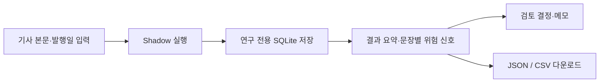

# Shadow Mode UI 설계

| 항목 | 내용 |
| --- | --- |
| Author | Human Team + Codex |
| Reviewed by | Human Team |
| Managed by | Codex |
| Status | Approved |
| Version | v0.1 |
| Last Updated | 2026-07-28 |

## 목적

기존 `검증 실험실` 안에서 운영 검증과 완전히 분리된 Shadow 실험을 실행·검토·기록한다. 사용자는 기사 본문을 입력하고, Python·LLM·Hybrid 비교 결과와 위험 신호를 확인한 다음 검토 이력 및 JSON·CSV 기록을 남긴다.

## 화면 구조

`검증 실험실`은 두 탭으로 나눈다.

1. `기존 비교 실험`: 현재 구현을 변경하지 않고 유지한다.
2. `Shadow Mode`: 아래 흐름을 제공한다.

Shadow 탭의 순서는 실행 영역, 요약 영역, 문장별 결과 영역, 검토 영역, 기록 다운로드 영역이다.

## 데이터 및 안전 경계

- UI는 `ShadowLabService`만 호출한다.
- 연구 데이터는 `data/research/shadow_lab.db`에만 기록한다.
- 운영 Claim, 운영 리뷰 큐, 운영 판정 이력, 기존 `verification_lab.db`를 쓰지 않는다.
- HCX 미설정·호출 오류는 실행 실패가 아니라 문장별 `llm_error` 및 `needs_review` 상태로 표시한다.

## 오류 처리

- 빈 본문은 실행하지 않고 안내한다.
- 서비스 실행·저장 오류는 Streamlit 오류 메시지로 표시하며 이전 실행 결과를 지우지 않는다.
- 검토 저장 실패는 해당 동작만 실패로 표시한다.
- 다운로드는 저장된 실행을 기준으로 제공하며, 실행 결과가 없을 때는 숨긴다.

## 테스트 기준

- Shadow 탭 렌더링에 필요한 실행 입력과 기본 경로를 순수 함수로 분리한다.
- 실행 요청이 서비스에 전달되고 결과가 세션에 보존되는지 검증한다.
- 검토 요청과 JSON·CSV 페이로드 준비를 검증한다.
- 기존 `검증 실험실` 테스트 및 Shadow 핵심 테스트의 회귀를 실행한다.
