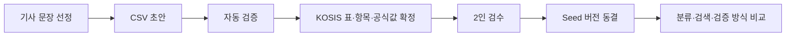

# 골든셋 Seed 100 설계

## 목표

뉴스 수치 주장과 KOSIS 근거의 연결·분류·검증 방식을 같은 기준으로 비교할 수 있도록, 연구 전용 골든셋 Seed 100을 만든다. Seed는 물가·고용·인구·주거·보건 분야를 각 20건씩 포함한다.

## 범위와 원칙

- 골든셋은 운영 Claim·리뷰·판정 데이터와 완전히 분리한다.
- 사람 편집용 CSV와 프로그램용 JSONL은 같은 논리 레코드를 표현한다.
- KOSIS의 표·선택 항목·공식값·스냅샷을 함께 기록해 정답 근거를 추적할 수 있게 한다.
- 미확정 행은 실험 평가 대상에서 제외한다.
- 동결한 버전은 덮어쓰지 않으며, 정답 변경은 다음 버전으로 남긴다.

## 데이터 구조

연구 전용 원본은 `data/research/goldenset/` 아래에 둔다.

| 파일 | 역할 |
| --- | --- |
| `seed_v0.1.jsonl` | 한 줄 한 주장인 프로그램용 원본 |
| `seed_v0.1.csv` | 팀 편집·검수용 표 형식 |
| `seed_manifest_v0.1.json` | 스키마 버전, 목표·현재 건수, 분야별 분포 |
| `annotation_guideline_v1.md` | 라벨 정의, 입력 예시, 검수 규칙 |

각 레코드는 원문, 문장 분류 정답, KOSIS 정답, 품질 추적을 가진다.

- 원문: `claim_id`, 기사 발행일, 문장, 수치 표현
- 문장 정답: 검증 가능 여부, 주장 유형, 지표, 값, 단위, 기준·비교 시점, 지역, 대상
- KOSIS 정답: 표 ID·표 제목·선택 항목·좌표/조건·공식값·계산식·URL·스냅샷
- 품질 추적: 작성자, 검수자, 상태, 작성·검수 시각, 주석

## 팀 작업 흐름

1. 팀원이 CSV에서 문장과 1차 라벨을 작성한다.
2. 검증기는 필수값, 허용 라벨, 중복, 분야별 목표 분포를 확인한다.
3. KOSIS 연결은 Shadow Mode의 후보·스냅샷을 이용해 표 ID, 선택 항목, 공식값을 확정한다.
4. 다른 검수자가 승인해야 골든 정답으로 쓸 수 있다.
5. `approved` 행만 실험 평가에 포함한다.
6. 동결 뒤 변경이 필요하면 `v0.2`를 만들어 이전 실험의 재현성을 보존한다.

## 첫 구현 범위

- 골든셋 스키마, CSV/JSONL 템플릿, 작성 가이드
- 파일 기반 검증 모듈
- Shadow Mode의 연구 전용 `골든셋 현황` 영역
  - 전체 목표·현재 건수
  - 분야별 목표/현재/부족 건수
  - 승인·검수대기·보류 건수
  - 오류와 누락 필드
  - CSV 템플릿·검증 결과 다운로드
- 스키마·필수값·분포·중복·승인 및 KOSIS 정답 조건의 자동 테스트

첫 단계에서는 업로드 후 자동 반영, 대규모 실험 대시보드, 운영 데이터 변경을 포함하지 않는다.

## 실패 처리

- JSONL·CSV가 서로 다른 레코드를 나타내면 검증 오류로 표시한다.
- 필수 라벨·KOSIS 표 ID·공식값이 없는 `approved` 행은 오류로 처리한다.
- 분야가 목표 20건에 미달하거나 초과하면 현황과 검증 결과에 표시한다.
- 중복 `claim_id` 또는 같은 정규화 문장은 중복 오류로 기록한다.

## 성공 기준

- Seed v0.1에 물가·고용·인구·주거·보건이 각각 20건으로 기록된다.
- 모든 평가 대상 행은 승인 상태이며 추적 가능한 KOSIS 근거를 가진다.
- 어떤 실험 방식도 같은 동결 버전과 비교할 수 있다.
- Shadow Mode에서 진행률과 데이터 품질 문제를 읽기 전용으로 확인할 수 있다.
