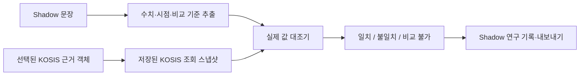

# KOSIS 실제 수치 대조 설계

## 목적

Shadow Mode에서 뉴스 수치 문장과 선택된 KOSIS 근거 객체의 **조회 스냅샷 실제 값**을 비교한다. 이 기능은 연구 기록만 만들며 운영 Claim·리뷰·판정은 변경하지 않는다.

## 채택 방식: 스냅샷 우선 대조

문장과 매핑된 근거 객체에 연결된 KOSIS 조회 스냅샷만 비교 대상으로 삼는다. 매 실행마다 KOSIS를 다시 조회하는 방식은 최신성은 높지만 당시 근거를 재현할 수 없으므로 채택하지 않는다.

## 비교 입력

- 문장: Shadow 실행의 문장과 파싱된 수치·기간 정보
- 근거: `evidence_id`로 특정한 KOSIS 근거 객체
- 스냅샷: 해당 근거 객체의 저장된 조회 결과와 조회 시각
- 선택 조건: 지표·기간·분류 항목이 문장 주장과 직접 비교 가능한지 판단하는 근거

## 결과 계약

`KosisValueComparison`은 다음을 기록한다.

- `match`: 같은 기간·같은 지표·동일 단위의 값이 허용 오차 안에서 일치
- `mismatch`: 비교 가능한 값이 있으나 수치가 다름
- `not_comparable`: 기간·지표·단위·선택 조건 또는 스냅샷이 없어 자동 대조 불가
- 주장 수치, 공식 수치, 사용 스냅샷 ID/조회 시각, 판정 이유, 허용 오차

퍼센트 값은 기본적으로 절대 오차 `0.05`%p까지 일치로 본다. 다른 단위는 정확히 같을 때만 일치로 본다. 이 규칙과 실제 비교값은 모두 기록한다.

## 범위와 경계

- 이 단계는 "표가 관련 있는가" 점수와 구분한다. 기존 근거 적용 가능성 점수는 유지하고, 실제 값 대조 결과를 별도 표시한다.
- 스냅샷에 담기지 않은 행, 기간 또는 품목은 추측하지 않고 `not_comparable`로 남긴다.
- 초기 UI는 현재 선택된 문장·근거 조합에서 저장된 최신 스냅샷을 대상으로 수동 실행한다. 배치 자동 판정은 다음 단계로 분리한다.
