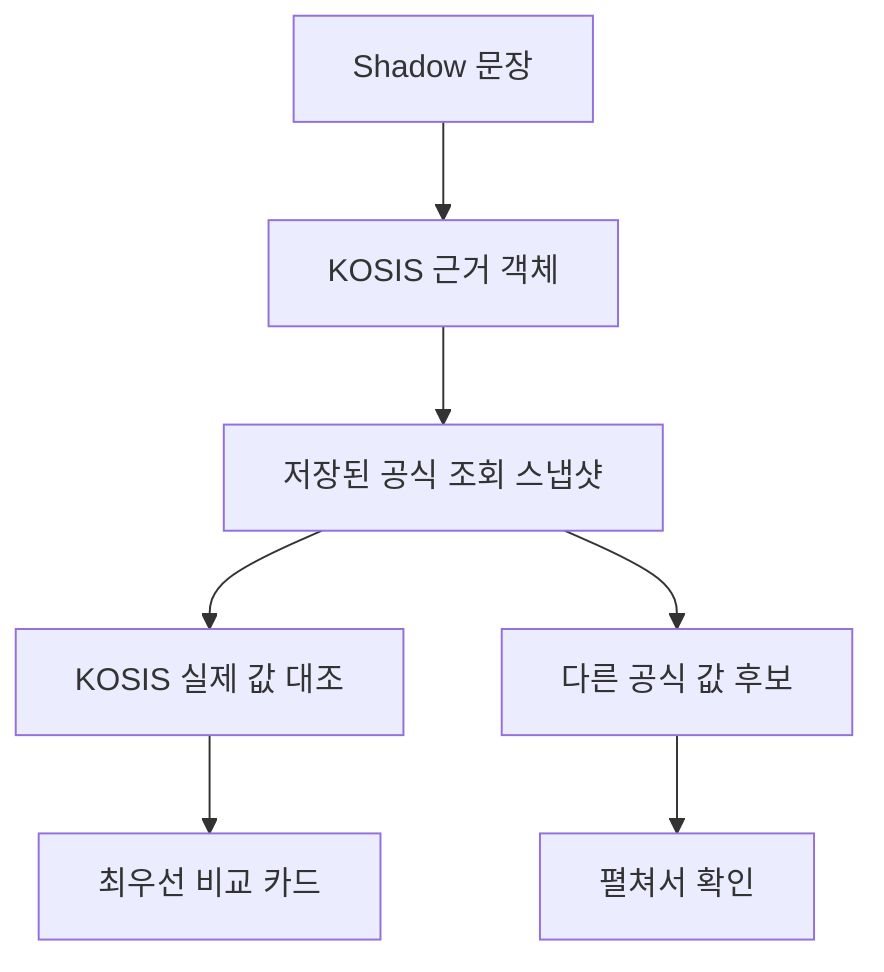

# KOSIS 실제 값 비교 카드 설계

## 목표

Shadow Mode에서 이미 저장된 KOSIS 실제 값 대조 결과를 사람이 한눈에 해석할 수 있게 한다. 최우선 공식 값 한 건을 먼저 보여 주고, 동일 스냅샷의 나머지 후보는 펼쳐서 확인하게 한다.

## 범위와 원칙

- 기존 `compare_claim_to_snapshot()`의 기간·지표·선택 조건·값 성격·단위·수치 비교 로직은 변경하지 않는다.
- 카드와 후보 목록은 저장된 비교 결과와 조회 스냅샷을 읽기만 한다.
- 운영 Claim·리뷰 큐·판정은 바꾸지 않는다.
- 비교 기록 저장은 기존 `KOSIS 실제 값 대조` 버튼의 명시적 행동만 사용한다.

## 화면 흐름

`KOSIS 실제 값 대조`가 끝나면 먼저 비교 카드가 나타난다.

- 상단은 문장 값, 선택된 KOSIS 값, 최종 상태를 나란히 표시한다.
- 중단은 기간, 지표, 선택 조건, 값 성격, 단위 게이트를 통과/검토 필요로 표시한다.
- 하단은 공식 값의 기간·지표·선택 조건, 스냅샷 ID와 조회 시각을 표시한다.
- 후보가 둘 이상이면 `다른 공식 값 후보 보기`에서 현재 근거와의 일치·제외 사유를 확인한다.

## 후보 정렬

카드는 실제 대조에 사용한 레코드를 최우선으로 표시한다. 나머지 스냅샷 레코드는 동일 기간, 지표, 선택 조건, 단위 순으로 현재 근거와의 일치 여부를 계산해 정렬한다. 이 정렬은 추천·설명 전용이며 비교 결과나 근거 객체를 수정하지 않는다.

## 실패 처리

대조 결과가 `not_comparable`이면 카드에 비교 불가 사유와 실패한 게이트를 표시한다. 후보가 없으면 빈 후보 목록 대신 “동일 기간의 공식 값 후보가 없습니다”를 표시한다. 이 경우에도 사용자는 근거 보정·보류·재조회로 돌아갈 수 있다.

## 테스트

- 순수 헬퍼가 대조 레코드를 최우선으로 놓고 나머지 후보를 일치도 순으로 정렬하는지 검증한다.
- 후보가 없거나 비교 불가인 경우도 안전하게 렌더링 모델을 만드는지 검증한다.
- Streamlit 소스 계약 테스트로 비교 카드, 후보 펼침 영역, 게이트·출처 표시가 기존 대조 결과 다음에 렌더링되는지 검증한다.
